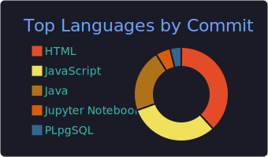
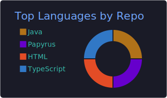

<!-- README.md — professional profile -->

<h1 align="center">Jesús Ariel González Bonilla</h1>

  Full-stack Developer &nbsp;|&nbsp; Go · Spring Boot · Vue.js &nbsp;|&nbsp; AI & Technical Teaching

  
  

---

## 🗒 About Me
Full-stack developer with **ten years** of experience building clean, robust, and scalable solutions.  
I work mainly with **Go** and **Spring Boot**, I’m pursuing a **postgraduate diploma in Artificial Intelligence**, and I’m part of **AI4Devs Seniors**.  
I combine my technical work with **higher-education teaching**, promoting critical thinking and sound engineering practices.

---

## 💼 Professional Background
- **2015 – present** | Commercial and academic projects in Go, Spring Boot, and Vue.js  
- Design and maintenance of clean architectures, microservices, and REST APIs  
- Technical leadership in agile teams and mentoring of junior developers  

---

## 🛠 Technical Skills
| Area | Technologies |
|------|--------------|
| **Languages** | Go · Java (Spring Boot) · Python · PHP · SQL |
| **Frontend & Mobile** | Vue.js · Ionic |
| **Databases** | PostgreSQL · MySQL · SQL Server · MongoDB |
| **DevOps & Quality** | Git · Docker · CI/CD (GitHub Actions, GitLab CI) · Testing |
| **Architecture** | Clean Architecture · REST API · UML |

---

## 👨‍🏫 Teaching Experience
More than seven years teaching software development in higher education, guiding both academic and professional projects.

---

## 🎓 Education
- Postgraduate Diploma in **Artificial Intelligence** *(ongoing)*  
- **AI4Devs Seniors** Program *(ongoing)*  
- Master’s in **Information Systems Management and Technology Projects**  
- Postgraduate Diploma in **Pedagogical Processes for Vocational Training**  
- Postgraduate Diploma in **Database Security**  
- **B.Sc. in Computer Engineering**  
- Technologist in **Analysis and Software Development (ADSI)**  

---

## 🔥 GitHub Stats

  
  
   
  
  
   
  

> These cards are updated daily by a GitHub Actions workflow and include my private contributions.

---

## 📬 Contact
| | |
|---|---|
| **Email** | [jesusarielgb@gmail.com](mailto:jesusarielgb@gmail.com) |
| **LinkedIn** | <https://www.linkedin.com/in/jesusarielgonzalezbonilla> |

---

<em>“Technology should solve real problems and bring opportunities closer to everyone.”</em> 🚀

