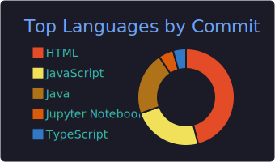
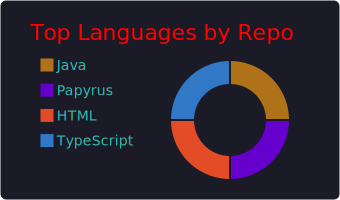

<!-- README.md — template -->

<h1 align="center">{{FULL_NAME}}</h1>

  {{ROLE}} &nbsp;|&nbsp; {{STACK}} &nbsp;|&nbsp; {{FOCUS}}

  
  

---

## 🗒 About Me
{{ABOUT_ME}}

---

## 💼 Professional Background
{{PROFESSIONAL_BACKGROUND}}

---

## 🏗️ Colaborate 
- [Código SENA]({{CODE_SENA_URL}})
- [Código CORHUILA]({{CODE_CORHUILA_URL}})

---

## 🛠 Technical Skills
| Area | Technologies |
|------|--------------|
| **Languages** | {{LANGUAGES}} |
| **Frontend & Mobile** | {{FRONTEND}} |
| **Databases** | {{DATABASES}} |
| **DevOps & Quality** | {{DEVOPS}} |
| **Architecture** | {{ARCHITECTURE}} |

---

## 👨‍🏫 Teaching Experience
{{TEACHING_EXPERIENCE}}

---

## 🎓 Education
{{EDUCATION}}

---

## 🔥 GitHub Stats

  
  
   
  
  
   
  

---

## 📬 Contact
| | |
|---|---|
| **Email** | [{{EMAIL}}](mailto:{{EMAIL}}) |
| **LinkedIn** | <{{LINKEDIN_URL}}> |

---

<em>{{QUOTE}}</em> 🚀
