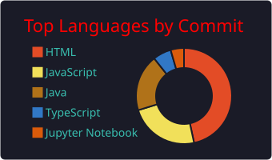
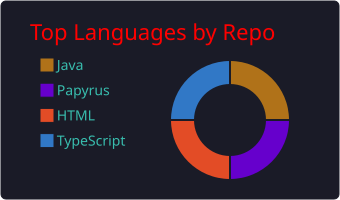

<!--
CONFIG
FULL_NAME: Jesús Ariel González Bonilla
ROLE: Software Developer
STACK: Go · Spring Boot · PostgreSQL
FOCUS: Backend · Software Architecture · AI
GITHUB_USER: ariel5253
QUOTE: Technology should solve real problems.
-->

<h1 align="center">Jesús Ariel González Bonilla</h1>

  Software Developer &nbsp;|&nbsp; Go · Spring Boot · PostgreSQL

  Backend Development · Software Architecture · Artificial Intelligence

---

## About Me

Software developer focused on building maintainable, reliable, and scalable solutions.

My main areas of interest are backend development, distributed systems, software architecture, databases, cloud technologies, and artificial intelligence.

---

## Technical Focus

| Area               | Technologies                                   |
| ------------------ | ---------------------------------------------- |
| **Backend**        | Go · Java · Spring Boot                        |
| **Databases**      | PostgreSQL · MySQL · MongoDB                   |
| **Cloud & DevOps** | AWS · Docker · CI/CD                           |
| **Architecture**   | Microservices · Clean Architecture · REST APIs |
| **Additional**     | Python · Vue.js · SQL                          |

---

## GitHub Activity

  
  
   
  
  

---

  <em>Technology should solve real problems.</em>

