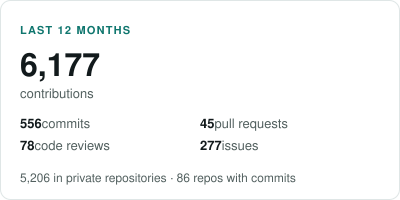
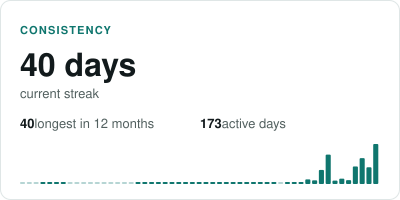

<!--
CONFIG
FULL_NAME: Jesús Ariel González Bonilla
ROLE: AI Software Engineer
STACK: Agents with LangGraph & MCP · Backend in Java, Go & Kafka
FOCUS: Backend · Software Architecture · AI
GITHUB_USER: ariel5253
QUOTE: Technology should solve real problems.
-->

<h1 align="center">Jesús Ariel González Bonilla</h1>

  AI Software Engineer &nbsp;|&nbsp; Agents with LangGraph &amp; MCP · Backend in Java, Go &amp; Kafka

  <a href="https://ariel5253.github.io">Portfolio</a> &nbsp;·&nbsp;
  <a href="https://www.linkedin.com/in/jesusarielgonzalezbonilla">LinkedIn</a>

  Backend Development · Software Architecture · Artificial Intelligence

---

## About Me

Software developer focused on building maintainable, reliable, and scalable solutions.

My main areas of interest are backend development, distributed systems, software architecture, databases, cloud technologies, and artificial intelligence.

---

## Technical Focus

| Area               | Technologies                                   |
| ------------------ | ---------------------------------------------- |
| **Backend**        | Go · Java · Spring Boot                        |
| **Databases**      | PostgreSQL · MySQL · MongoDB                   |
| **Cloud & DevOps** | AWS · Docker · CI/CD                           |
| **Architecture**   | Microservices · Clean Architecture · REST APIs |
| **Additional**     | Python · Vue.js · SQL                          |

---

## GitHub Activity

  <picture>
    <source media="(prefers-color-scheme: dark)" srcset="assets/activity-dark.svg">
    
  </picture>
  <picture>
    <source media="(prefers-color-scheme: dark)" srcset="assets/consistency-dark.svg">
    
  </picture>

---

  <em>Technology should solve real problems.</em>

