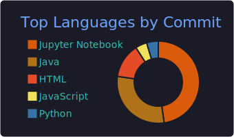
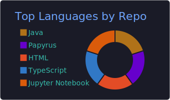

<!-- README.md — perfil profesional -->

<h1 align="center">Jesús Ariel González Bonilla</h1>

  Desarrollador full-stack &nbsp;|&nbsp; Go · Spring Boot · Vue.js &nbsp;|&nbsp; IA &amp; docencia técnica

  
  

---

## 🗒 Sobre mí
Desarrollador **full-stack** con **diez años** de experiencia en la creación de soluciones limpias, robustas y escalables.  
Trabajo con **Go** y **Spring Boot**, curso una **Especialización en Inteligencia Artificial** y participo en **AI4Devs Seniors**.  
Combino mi labor técnica con la **docencia** en educación superior, fomentando pensamiento crítico y buenas prácticas de ingeniería.

---

## 💼 Trayectoria profesional
- **2015 – presente** | Proyectos comerciales y académicos en Go, Spring Boot y Vue.js.  
- Diseño y mantenimiento de arquitecturas limpias, microservicios y API REST.  
- Liderazgo técnico en equipos ágiles y mentoría a desarrolladores junior.  

---

## 🛠 Competencias técnicas
| Área | Tecnologías |
|------|-------------|
| **Lenguajes** | Go · Java (Spring Boot) · Python · PHP · SQL |
| **Frontend & mobile** | Vue.js · Ionic |
| **Bases de datos** | PostgreSQL · MySQL · SQL Server · MongoDB |
| **DevOps & calidad** | Git · Docker · CI/CD (GitHub Actions, GitLab CI) · Testing |
| **Arquitectura** | Clean Architecture · API REST · UML |

---

## 👨‍🏫 Experiencia docente
Más de siete años impartiendo desarrollo de software en **SENA**, **Corporación Universitaria Corhuila** y **UNAB**, acompañando proyectos académicos y profesionales.

---

## 🎓 Formación académica
- Especialización en **Inteligencia Artificial** *(en curso)*  
- Programa **AI4Devs Seniors** *(en curso)*  
- Maestría en **Gerencia de Sistemas de Información y Proyectos Tecnológicos**  
- Especialización en **Procesos Pedagógicos de la Formación Profesional**  
- Especialización en **Seguridad de Base de Datos**  
- **Ingeniería de Sistemas**  
- Tecnólogo en **ADSI** (Análisis y Desarrollo de Sistemas de Información)

---

## 🔥 Estadísticas de GitHub

  
  
   
  
  
   
  

> Estas tarjetas se actualizan automáticamente cada día mediante un workflow de GitHub Actions e incluyen mis contribuciones privadas.

---

## 🤝 Comunidades y colaboraciones
| Comunidad / Programa | Ciudad / País | Repositorio |
|----------------------|--------------|-------------|
| Academic Sessions Corhuila | Neiva, Colombia | [code-corhuila](https://github.com/code-corhuila) |
| Academic Sessions UNAB | Bucaramanga, Colombia | [UNAB](https://github.com/UNAB) |
| Academic Sessions SENA | Colombia | [code-sena](https://github.com/code-sena) |
| Developer Code FullStack | Colombia | [DeveloperCode-FullStack](https://github.com/DeveloperCode-FullStack) |
| Hackaboss Bootcamps | España | [hackaboss-bootcamps](https://github.com/hackaboss-bootcamps) |
| Research Hotbed Developers Geeks | Neiva, Colombia | [developers-geeks](https://github.com/developers-geeks) |

---

## 📬 Contacto
| | |
|---|---|
| **Correo** | [jesusarielgb@gmail.com](mailto:jesusarielgb@gmail.com) |
| **LinkedIn** | <https://www.linkedin.com/in/jesusarielgonzalezbonilla> |

---

<em>“La tecnología debe resolver problemas reales y acercar oportunidades a todos.”</em> 🚀

